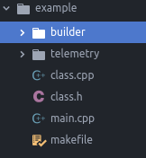

# builder

# How to use?

## Simple

1. Copy `makefile_simple` to your project.
2. Rename it to `makefile`.
3. Set correctly path to `builder/builder.mk` into variable.
4. Run `make` or `make all`.

Builder take all you sources (\*.c \*.cpp \*.s \*.S) from current directory and will try to compile these.
All subdirs in this directory added like `-I` to sources, for searching include files.

Your project structure may look something like this:

## Divide and rule

1. Copy `makefile_full` to your project.
2. Rename it to `makefile`.
3. Set correctly path to `builder/builder.mk` into variable.
5. Set all variables as you like (see point [Settings]()).
4. Run `make` or `make all`.

# Settings

| Variable name | Description | Is it necessary? |Possible values | Default value	|
|---	|---	|---	|---	|---	|
| SILENCE | Is silent mode on? 	| No | `false` / `true` | `true` |
|   	|   	|   	|   	|   	|
|   	|   	|   	|   	|   	|
|   	|   	|   	|   	|   	|
|   	|   	|   	|   	|   	|
|   	|   	|   	|   	|   	|
|   	|   	|   	|   	|   	|
|   	|   	|   	|   	|   	|
|   	|   	|   	|   	|   	|
|   	|   	|   	|   	|   	|
|   	|   	|   	|   	|   	|
|   	|   	|   	|   	|   	|
|   	|   	|   	|   	|   	|
|   	|   	|   	|   	|   	|
|   	|   	|   	|   	|   	|
|   	|   	|   	|   	|   	|
|   	|   	|   	|   	|   	|
|   	|   	|   	|   	|   	|
|   	|   	|   	|   	|   	|
|   	|   	|   	|   	|   	|
|   	|   	|   	|   	|   	|
